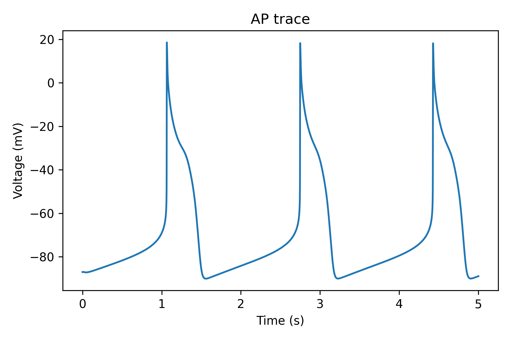
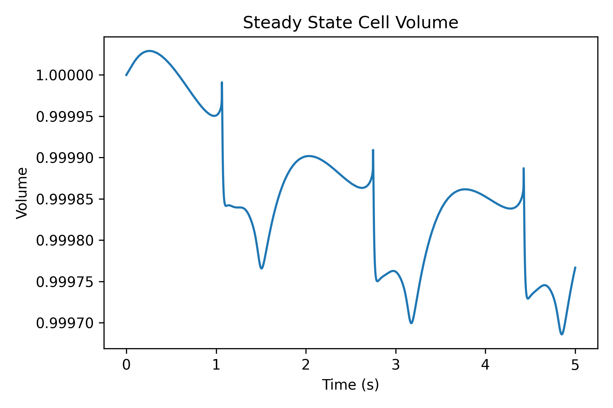
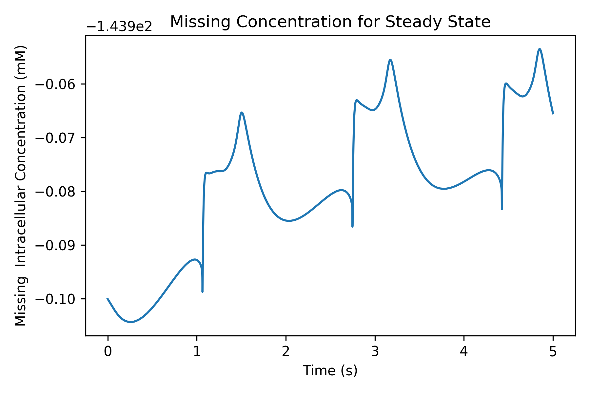
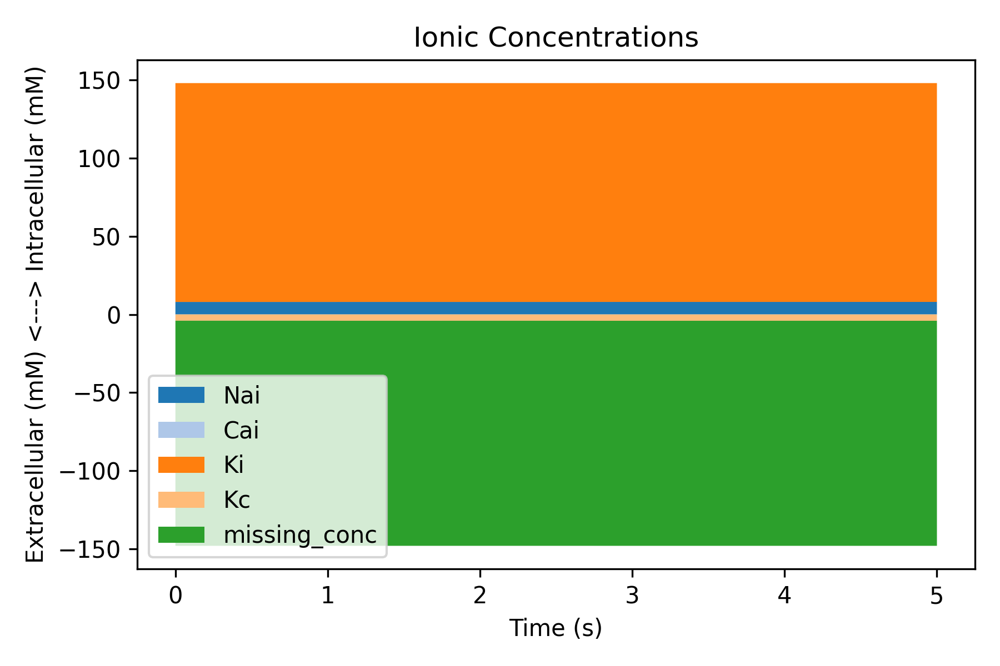

# Track cell osmolarity and volume
## Introduction
With this repo you can take a cellml model, record its ionic concentrations over time, track how the volume of the cell would change (assuming it was in steady state initially), and track the missing concentration needed for the cell to maintain its volume.

## Git clone
Feel free to download this however you want to (git clone, download zip, etc.).

## Choose a model
Models can be downloaded from the [cellML repository](https://models.cellml.org/electrophysiology). The model can then be put into the **models** directory.

## Create the myokit models
The file **create_osmo_model.py** can read a cellml file, create a myokit model of it, as well as a myokit model with the osmolarity tracking component. 
### Step 1
Change the *filename* in the file to point to the cellml model file (without any extensions). For example: 
```python
filename = 'models/difrancesco_noble_1985'
```
to use the noble 1985 model.
### Step 2
Run the **create_osmo_model.py**, which will create a myokit .mmt file in the **models** directory. It will then likely through up some errors about the choices of concentrations.

### Step 3
If there were no errors, just skip to Step 4. If there were errors, you will need to change the concentrations in the **create_osmo_model.py** file. The concetrations are list of strings containing the myokit qnames of the intra- and extra-cullular ionic concentrations. For example, the noble 1985 model has the following concentrations:
```python
intra = [f'intracellular_{a}_concentration.{b}' for a, b in
         [('sodium', 'Nai'), ('calcium', 'Cai'), ('potassium', 'Ki')]]
extra = ['extracellular_potassium_concentration.Kc']
```
You'll have to find these by opening the myokit .mmt model file and searching for them.
Once you have changed the concentrations, run the **create_osmo_model.py** file again.

### Step 4
If everything has worked, you should get a myokit model file that ends with **_osmo.mmt**. This is the model with the osmolarity tracking component.
You can now tweak the plot_osmo.py file with the same filename and concentrations and it *should* work. There may be some awkwardness depending on time units and probably loads of other things I haven't thought of.
Once you have added the filename and concentrations, you can run the **plot_osmo.py** file to plot the model.

## Plots
The plots will be saved in the **figures** directory. 
### Plot 1 - AP Trace
The first plot, labelled **ap-trace** will show the action potential trace of the model.



### Plot 2 - Volume
The second plot, labelled **volume** will show the volume of the cell over time. This is under the assumption that the cell has exactly the missing concentration needed to maintain its volume initially, which is then perturbed as the ionic concentrations change over time.



### Plot 3 - Missing Concentration
The third plot, labelled **missing_conc** will show the missing concentration needed to maintain the cell's volume over time.



### Plot 4 - Ionic Concentrations
The fourth and final plot, labelled **concentrations** will show the ionic concentrations over time. The ions are separated by colour and intracellular concentrations are shown as positive and extracellular concentrations are shown as negative. 
The missing concentration tracks that given in the third plot (concentration needed to keep the volume fixed).


